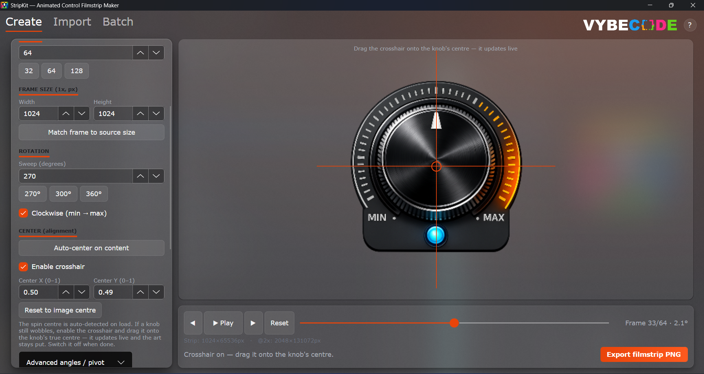

<div align="center">
  
  <h1>StripKit</h1>
  <p><b>Turn one transparent PNG into a frame-perfect animated filmstrip for audio-plugin GUIs — knobs, faders, sliders, meters, and buttons.</b></p>

  <p>
    <a href="LICENSE"></a>
    <a href="https://github.com/Vybecode-LTD/stripkit/releases/latest"></a>
    <a href="https://github.com/Vybecode-LTD/stripkit/releases"></a>
    
    
  </p>

  <p><b>Free, forever. Open source.</b>&nbsp; · &nbsp;<a href="https://github.com/Vybecode-LTD/stripkit/releases/latest">Download</a> · <a href="https://stripkit.pro">stripkit.pro</a> · <a href="#-features">Features</a> · <a href="#-contributing">Contributing</a></p>

  
</div>

---

## What is StripKit?

Audio-plugin GUIs animate knobs, faders, and meters with a **filmstrip** (a.k.a. sprite
sheet): one tall PNG holding every frame of the control stacked top-to-bottom, where the
plugin shows frame *N* for parameter value *N*. Hand-authoring those is tedious and
error-prone.

StripKit does it for you. Feed it a **single transparent PNG** of your control and it
renders the whole strip — correctly rotated about the art's true centre, supersampled, and
crisp at every frame. It also **imports** existing strips (KnobMan exports, purchased
packs) to re-slice, re-stack, or resample them, processes a **whole folder in batch**, can emit a
**`skin.json` manifest** that binds a strip to a parameter for a JUCE-style `LookAndFeel`
loader, and — when you have no art at all — can **generate** layered control art for you from
your own OpenAI / Gemini / Claude key.

It's the asset-production companion to VybeCode's plugin GUI tooling — and it's **free and
open source under the MIT license**.

## ⬇️ Download (Windows)

**[Download the latest installer →](https://github.com/Vybecode-LTD/stripkit/releases/latest)**

- **Self-contained** — no .NET runtime needed on the target machine.
- **Per-user install:** choose your folder, optional desktop + Start-Menu shortcuts, and a
  clean uninstaller that leaves nothing behind.
- Every release is **VirusTotal-scanned** (report + SHA-256 in the release notes) and
  **code-signed** (Azure Trusted Signing).

Prefer a one-page overview with the live download and changelog? See **[stripkit.pro](https://stripkit.pro)**.

## ✨ Features

- **Rotary knobs** — any sweep (270° / 300° / 360° / custom), rotated about the art's *true*
  centre so it spins clean — no wobble.
- **Faders & sliders** — vertical faders and horizontal sliders with pixel-accurate end margins.
- **Meters** — procedural LED segments or layered on/off art; four fill directions; discrete
  or continuous.
- **Buttons & toggles** — discrete-state filmstrips (off / on, plus hover / pressed / disabled);
  import a layered file with groups named `off` and `on` and the states are assigned automatically.
- **Layered knobs** — composite a static body + a separate rotating pointer (load each layer,
  auto-extract them from flat art, or import a layered SVG / PSD) so only the pointer moves.
- **AI generation (Generate tab)** — bring your own OpenAI / Gemini / Claude key and generate
  layered control art (knob / fader / slider / button); your key is encrypted on your own machine.
- **Smart alignment** — auto-detects the spin centre on load; a draggable crosshair lets you
  nail it by eye on a smooth 1024-step preview.
- **Filmstrip importer** — detects an existing strip's frame count and orientation, extracts
  a single frame, re-stacks it, or resamples it to a new frame count.
- **Batch processing** — point it at a folder and render the whole set off the UI thread,
  with progress and a working cancel.
- **`skin.json` manifest** — schema-valid output binding each strip to a parameter id (single
  control on export, or a multi-control skin from the **Skin** tab).
- **Loader code export** — emit ready-to-paste JUCE / CSS-HTML / iPlug2 / HISE loader snippets.
- **Crisp rendering** — supersampling + a Mitchell cubic resampler keep rotated edges sharp;
  one-toggle `@2x` HiDPI export.
- **Live preview** — scrub, play, or step frame-by-frame before you export.

## 🧰 Tech stack

| Area | Tech |
| --- | --- |
| Language / runtime | **C# / .NET 9** |
| UI | **Avalonia 11.3** — MVVM, compiled bindings |
| MVVM | **CommunityToolkit.Mvvm 8.4** (source generators) |
| Rendering | **SkiaSharp 3.119.2** (supersampling + Mitchell cubic) |
| Layered import | **Svg.Skia** (SVG) · **Magick.NET-Q8-x64** (PSD/PSB) |
| AI generation | OpenAI / Gemini / Claude over `HttpClient` · DPAPI-encrypted keys |
| DI | **Microsoft.Extensions.DependencyInjection** |
| Tests | **xUnit · NSubstitute · FluentAssertions · Avalonia.Headless** + golden-image regression |
| Packaging / CI | **Inno Setup** installer · **GitHub Actions** release pipeline · **VirusTotal** scan · **Azure Trusted Signing** |

The renderer, importer, and manifest services have **no Avalonia dependency**, so they're
reusable in a CLI or build step — `FilmstripEngine.cs` (repo root) is a standalone,
copy-paste-portable copy of the renderer.

## 🛠️ Build from source

Requires the [**.NET 9 SDK**](https://dotnet.microsoft.com/download). Builds and runs on
Windows, macOS, and Linux (Avalonia); Windows is the primary target.

> **Note:** The frosted acrylic glass effect is Windows-only. macOS and Linux use a solid dark fallback — the app is fully functional but visually different.

```bash
git clone https://github.com/Vybecode-LTD/stripkit.git
cd stripkit
dotnet run --project src/StripKit      # launch the app
dotnet test                            # 280 tests
```

Build a self-contained Windows release:

```bash
dotnet publish src/StripKit -c Release -r win-x64 --self-contained true -o publish
```

> If NuGet warns about a **SkiaSharp version conflict** with Avalonia, run
> `dotnet list package --include-transitive`, find the SkiaSharp version Avalonia pulls,
> and match it in `src/StripKit/StripKit.csproj`.

## 📖 Using the app

StripKit is a six-tab app: **Create**, **Import**, **Batch**, **Skin**, **Generate**, and **Assemble**.

**Create — single image → animated strip**
1. **Load a source PNG** (button or drag-and-drop onto the preview) — your transparent
   control art (a knob drawn pointing up at 12 o'clock; a fader/slider's moving cap).
2. Pick the **component type** (knob / vertical fader / horizontal slider / meter / button / toggle) and
   the **frame count** (32 / 64 / 128 or custom; 64 is standard).
3. Tune the per-type settings — rotary sweep & pivot, linear margins, meter segments &
   fill direction, or button states — and **align** the knob centre with auto-center or the crosshair.
4. **Preview** (scrub / play / step), then **Export** the stacked PNG (+ optional `@2x`, a
   `skin.json` manifest, and JUCE/CSS/iPlug2/HISE loader code).

**Import — re-use an existing strip:** load a strip; StripKit detects its layout (editable —
detection is a guess), scrub to confirm min → max, then extract a frame, re-stack the
orientation, or resample it to a new frame count.

**Batch — a whole folder at once:** choose input/output folders, set a render template, and
**Run** — each source becomes a strip (+ `@2x` / `.skin.json`) off-thread, with progress;
bad files are skipped and reported, and **Cancel** stops cleanly between files.

**Skin — bind many strips into one `skin.json`:** add controls from existing strips
(auto-detected) or blank, edit each control's id / type / parameter / bounds / value range,
set the skin-level metadata, and export one combined multi-control manifest.

**Generate — make control art with AI:** paste in your own OpenAI / Gemini / Claude API key
(stored encrypted on your machine), pick a control type and style, **Generate** a layered SVG,
preview it (the preview is the real import, so what you see will import), then **Use in Create**
to jump to the builder with the layers loaded — or Save / Copy the SVG.

**Assemble — a pre-rendered frame sequence → one strip:** rendered your control offline (Blender,
KeyShot, Octane, or any tool that emits a frame-per-image sequence)? Choose the folder (or drag-drop);
StripKit natural-sorts the frames (`frame_2` before `frame_10`), reconciles odd sizes, optionally
re-centres drifting content and re-times to 32 / 64 / 128, runs a render-QC pre-flight (drift, missing
transparency, blank or premultiplied frames), and packs them into one filmstrip — plus the same @2x /
`skin.json` / loader-code exports as Create. A **Render recipe** panel emits a Blender/CSV/JSON spec so
the offline render lands each frame on StripKit's exact angle.

**Quality tips:** give knob art ~10% transparent margin so corners don't clip on rotation;
exported PNGs are 32-bit RGBA with a transparent background (the plugin paints the
background, the filmstrip draws only the control).

## 🤝 Contributing

Contributions are very welcome — bug reports, feature ideas, and pull requests alike.

**Get oriented:** read `CLAUDE.md` (conventions), `docs/KICKOFF.md` (a fast bootstrap),
`docs/ARCHITECTURE.md` (the deep design), and `docs/SOURCE_MAP.md` (a file-by-file map).

**Workflow**
1. Fork the repo and branch off `main`.
2. Make your change and add/update tests — `dotnet test` must stay green (currently **280**).
3. Keep the house conventions:
   - Don't rewrite `Services/SkiaFilmstripRenderer.cs`; the rotation/supersampling math is
     deliberate (the `(N-1)` angle divisor is intentional — last frame lands exactly on max).
     Extend, don't replace.
   - If you touch the renderer math, mirror it in the standalone `FilmstripEngine.cs`.
   - Parse untrusted SVG (AI replies, imported files) only through `Services/SafeXml.cs` — never
     a bare `XDocument.Parse` (DTD / entity-expansion exposure).
   - View models don't reference Avalonia UI types (the preview `Bitmap` alias aside); use
     compiled bindings; re-use the `App.axaml` design tokens (the **Depth** machined-grey theme,
     `#f25914` ember accent, Verdana — monospace for numerics only). Don't hard-code hex.
4. Open a PR describing the change and referencing any issue it closes.

**Found a bug?** Open an issue with steps to reproduce (and the source PNG's dimensions for a
rendering/import bug). Fix tracking lives in `docs/BUGS.md`.

**Releases** are cut by maintainers via the automated pipeline (`docs/PACKAGING.md`) — you
don't need to touch versioning in a PR.

## 🗂️ Project layout

```
StripKit.sln
FilmstripEngine.cs          standalone, portable renderer (not compiled by the app)
src/StripKit/
  Program.cs, App.axaml     entry point + composition root (DI), Depth design tokens
  Depth/Depth.axaml         vendored Depth design-system tokens (mapped onto StripKit's keys in App.axaml)
  Models/                   FilmstripSettings, FrameTransform, StripDetection, SkinManifest, BatchModels, CodeModels, RenderLayer, GenerationModels, AppSettings, TutorialStep, enums (incl. ComponentType.Button, LayerBehavior.Frame)
  Services/                 renderer · importer · manifest · code-snippet · pointer-extractor · layered-import · SafeXml · batch · AI generation (providers + sanitizer + secret store) · image load · file dialog · export · settings · asset
  Helpers/                  SkiaImageInterop · HexToColorBrushConverter
  Controls/                 SectionHeader
  ViewModels/               MainWindowViewModel (Create) · ImporterViewModel · BatchViewModel · SkinViewModel · GenerateViewModel · FrameSequenceViewModel (Assemble) · TutorialViewModel · ImportedLayerRow
  Views/                    MainWindow (TabControl) · ImporterView · BatchView · SkinView · GenerateView · AssembleView · TutorialOverlay
tests/StripKit.Tests/       xUnit: renderer golden-image, alignment, VM, importer, manifest, batch, meter, value-arc, layered-knob, code-snippet, pointer-extractor, layered-import, Generate pipeline + integration, tutorial, settings
installer/StripKit.iss      Inno Setup installer script
scripts/Invoke-Release.ps1  local release driver (Stage 1)
.github/workflows/          ci.yml — build + test · auto-release.yml — CI release creator (Stage 2)
docs/                       ARCHITECTURE, SOURCE_MAP, ROADMAP, TESTING, CHANGELOG, BUGS, HANDOFF, AUDIT-LOG, PACKAGING, KICKOFF
```

## 📜 License

**MIT** — free for personal and commercial use, forever. Use it, modify it, ship it; just
keep the copyright and license notice. See [`LICENSE`](LICENSE).

© 2026 **VybeCode Software** · built with care at [vybeco.de](https://vybeco.de)

## 🔗 Links

- 🌐 Website — **[stripkit.pro](https://stripkit.pro)**
- 📦 Releases — **[github.com/Vybecode-LTD/stripkit/releases](https://github.com/Vybecode-LTD/stripkit/releases)**
- 🏷️ Developer — **VybeCode Software** · [vybeco.de](https://vybeco.de)
